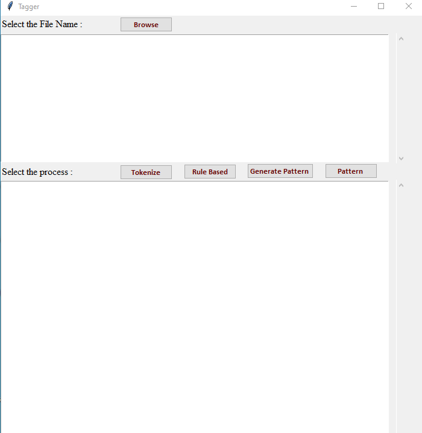
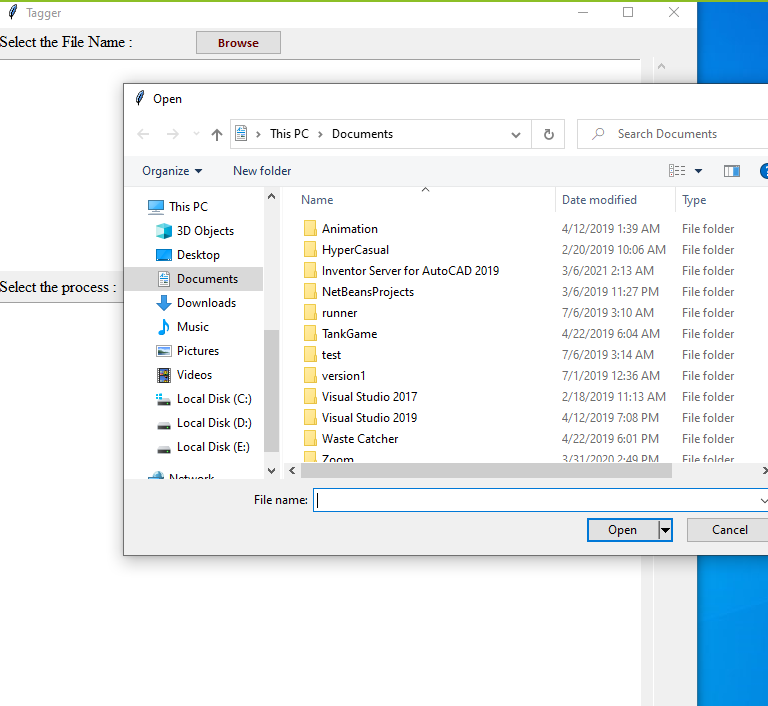
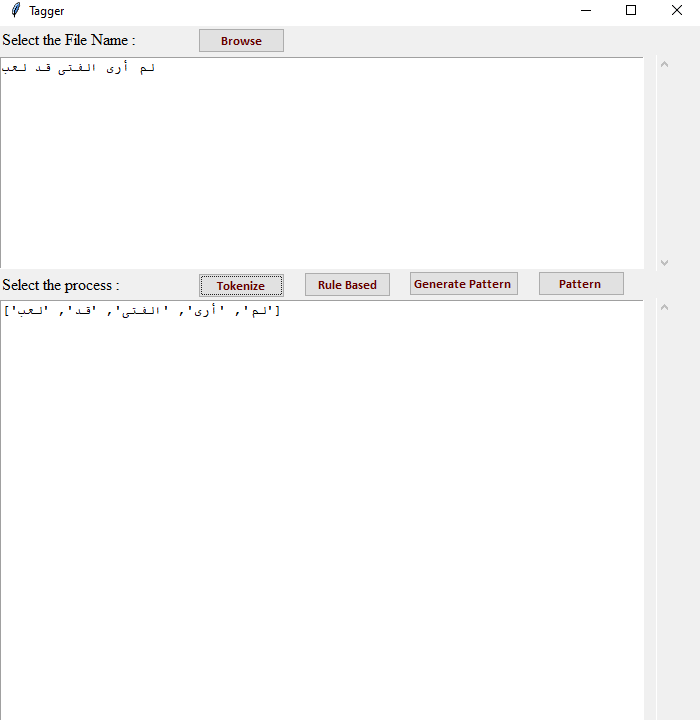
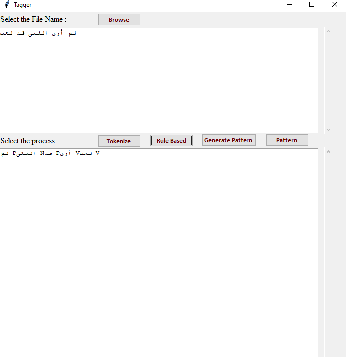
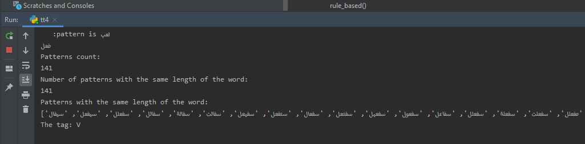

# POS-tagger

This is a POS tagging system project, built manually (as a future library).
It is built using Python language, Pycharm IDE, Excel workbooks.

**part-of-speech tagging** (POS tagging or PoS tagging or POST), also called grammatical tagging is the process of marking up a word in a text (corpus) as corresponding to a particular part of speech, based on both its definition and its context. 

This system was built to be tested on **Arabic Language**.

Parts of speech: 
1- Verbs
2- Nouns
3- Particle

## How to use it

1- Clone the repo
2- Open your Python IDE
3- Run the project

## What you will see

### 1- This is the desktop app you will see once you run the project

As you see it contains a search box to add the text you want to apply POS tagging on
And it has the functions you can do on this text:
1- Tokinize: The process of turning a piece of data (sentence in our case), into a string of characters called a token.
2- Rule Based: It will display to you the POS tag for each token.
3. Pattern: It will give you the pattern of each token.
4. Generate Pattern: It will generate patterns for each token according to words pattern rules in Arabic.

### 2- This is the screen you will see when clicking on Browse

Here you must choose a txt file 

### 3- After choosing the file, this is what you will see when clicking on Tokinize 

The file content will be separated to strings/words called tokens.

### 4- And when clicking on Rule Based 

You will see the tag of each word

### 5- When clicking on Pattern and Generate Pattern 

